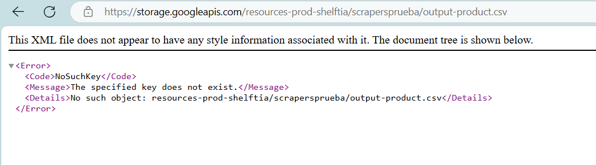

# Comentarios
#Ejercicio 1

El script se encuentra en el archivo Ejercicio_1.ipynb que esta en la 📁 carpeta de notebooks.

No esta disponible la salida esperada en el Ejercicio 1 en la url que proporcionan:

Por lo que propuse la siguiente salida:

#Ejercicio 2

Para el Ejercicio 2 genere la api en el archivo api_main.py, esta generado el archivo Docker para la generación de la imagen

Las pruebas las hice montando el contenedor en docker.

Cuando no hay productos como fue el caso de la url 2 y 3 (harinas-y-mezclas-para-preparar  y bebida-achocolatada-en-polvo ) como salida 
se da un json vacio 

y para cuando si hay productos como en la url 1 y 2 (enlatados-y-conservas y aceite) se dan los 15 primeros productos en la estructura json.

